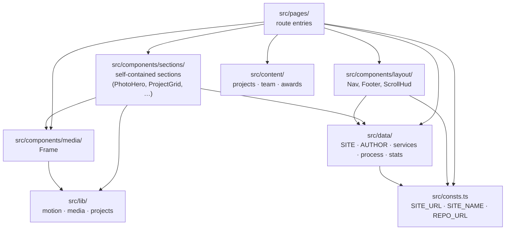

# Architecture

I keep this as a one-screen overview of how the codebase is shaped: the render model, the module layering, the data and content model, the motion runtime, the image pipeline, and the build/deploy boundary. ADRs in `docs/adr/` explain _why_ I made each load-bearing choice; `docs/deployment.md` is the operational picture for the hosting pipeline. Read those for depth; read this for orientation.

## Render model

Static-first MPA. Every route emits one HTML file at build time. `<ClientRouter />` from Astro view-transitions stitches navigations into one persistent session so the motion runtime is initialised once and torn down between routes — the perceived UX is SPA-like, the architecture is not. No SSR, no runtime, no Node server in production.


The deploy boundary is `dist/`. Everything to its left is owned by the codebase; everything to its right is owned by infrastructure. See [docs/deployment.md](./docs/deployment.md) for the full architecture, security model, cost analysis, and runbook; [ADR-0003](./docs/adr/0003-static-hosting-pipeline.md) for why every managed-platform alternative was rejected.

## Module layering

Three layers, dependencies flow one direction only — a route can reach into anything below it, nothing above can reach back up.



**Pages** import sections and arrange them; never own motion or styling. **Sections** are self-contained — markup plus an optional scoped `<script>` that registers motion via `scrollEffect`. **Layout** components (`Nav`, `Footer`, `ScrollHud`) wrap every page through `BaseLayout → PageLayout`. **`lib/`** is the only place pure logic lives — the only unit-test surface (`*.test.ts` colocated next to the code).

## Data and content

Two homes, split by one rule: _does it grow, is it a list of like items, would an editor edit it without touching component code?_ Yes → content collection. No → data module.

| Where                                  | What                                                                                                                                                                                                       | When                         |
| -------------------------------------- | ---------------------------------------------------------------------------------------------------------------------------------------------------------------------------------------------------------- | ---------------------------- |
| `src/content/projects/<slug>/index.md` | Built work, folder-per-project so photographs co-locate beside the markdown. Zod-validated in `src/content.config.ts`. Routed via `src/pages/projects/[slug].astro`.                                       | Editorial, grow-able.        |
| `src/content/team/<slug>/index.md`     | Studio principals. Optional co-located `portrait`. Referenced from project `credits`.                                                                                                                      | Editorial, grow-able.        |
| `src/content/awards.yaml`              | Recognition entries. Single YAML via the `file()` loader so awards don't churn one-file-per-entry.                                                                                                         | Append-only list.            |
| `src/data/site.ts`                     | `SITE` (fictional studio identity, in-fiction contact placeholders, studios, social, nav) and `AUTHOR` (real developer contact, surfaced only by `<meta name="portfolio-of">` and `/colophon`).            | Singletons, rarely changed.  |
| `src/data/{services,process,stats}.ts` | Other fixed config: services list, process phases, computed stats.                                                                                                                                         | Singletons.                  |
| `src/consts.ts`                        | `SITE_URL`, `SITE_NAME`, `SITE_DESCRIPTION`, `REPO_URL`. Single source of truth — `src/consts.test.ts` asserts the hostname literal never drifts between here, `src/data/site.ts`, and `astro.config.mjs`. | Build-time string constants. |

## Motion runtime

All scroll-driven motion goes through one module, `src/lib/motion/`. Effects never touch gsap plugin registration, the reduced-motion guard, or the view-transition lifecycle directly — they call `scrollEffect`.

```mermaid
sequenceDiagram
    participant Effect as Section &lt;script&gt;<br/>(import time)
    participant Core as motion/core.ts
    participant Runtime as motion/runtime.ts
    participant Astro as ClientRouter

    Effect->>Core: scrollEffect(setup)
    Note over Effect,Core: registry persists across the session
    Astro->>Runtime: astro:page-load
    Runtime->>Core: runAll()
    Core->>Effect: setup(ctx) → returns teardown
    Note over Effect: GSAP triggers + listeners created
    Astro->>Runtime: astro:before-swap
    Runtime->>Core: teardownAll()
    Core->>Effect: teardown()
    Note over Effect: triggers killed, listeners removed
```

Two non-obvious rules — both forced by `ClientRouter` and documented in [ADR-0001](./docs/adr/0001-motion-runtime.md):

1. The registry is **session-cumulative** (a section's `<script>` evaluates once per session, not per navigation). Setups must be DOM-defensive — no-op when their nodes aren't on the current page.
2. `ctx.refresh()` is a kept seam for async/late effects with no current clients (ADR-0002 retired the only one). Multiple calls in a frame collapse to one `ScrollTrigger.refresh()`.

The pure orchestration core (`motion/core.ts`) imports no gsap, so it is unit-tested under Vitest directly. Effects are not.

## Image pipeline

Photography is the primary visual medium. Real photos live in each entry's content folder, declared on the schema via `image()`, and rendered through `<Frame>` (`src/components/media/Frame.astro`) which delegates to `astro:assets` for responsive AVIF/WebP at build time. Until a real photo arrives, `<Frame>` falls back to a warm gradient placeholder (`src/lib/media/placeholder.ts`, unit-tested) so layout stays stable.

[ADR-0002](./docs/adr/0002-photography-led-redesign.md) records the pivot away from the earlier generative-visual identity (WebGL monolith + procedural drawings) toward photography-led editorial and restrained scroll motion.

## Build and deploy boundary

`pnpm build` is the only command that crosses from source into deploy. It runs Astro's static build, Sharp processes images, and `dist/` becomes a self-contained tree of static files. GitHub Actions on push to `main` runs the same `pnpm verify` I run locally, then deploys via OIDC-authenticated `aws s3 sync` to a hostname-named bucket fronted by Cloudflare. No long-lived AWS credentials exist anywhere; an AWS Budget at $5/mo caps cost exposure even in the worst case.

Edge response headers (CSP, HSTS, Permissions-Policy, etc.) live in Cloudflare Transform Rules, not in code, so they apply uniformly across HTML, hashed assets, and errors, and survive an origin migration (S3 → R2) with no re-implementation. The rule set is committed to [docs/security-headers.md](./docs/security-headers.md).

## Intentionally not here

- **No SSR or runtime.** Static MPA only. If a route ever needs request-time data, the right move is a Cloudflare Worker at the edge, not turning Astro into an SSR app.
- **No client framework.** No React, no Vue, no Svelte. Section components are Astro plus minimal scoped scripts; the motion runtime is the only JS code that runs across multiple sections.
- **No CMS.** Content lives in the repo. Editors edit markdown.
- **No backend.** The contact form posts directly to Web3Forms. There is no application server, no database, no auth.
- **No managed hosting CDN.** [ADR-0003](./docs/adr/0003-static-hosting-pipeline.md) explains why every managed platform (Amplify, Vercel, Netlify, Pages) was rejected in favour of S3 + Cloudflare. Single CDN, cheapest origin, full edge control.
- **No analytics or error tracking.** Not yet. Cloudflare Web Analytics and a CSP reporting endpoint are on the roadmap (see `docs/roadmap.md`).

This shape is the point. The discipline it lets me hold — one toolchain to learn, one place to look — is the senior-engineering bet.
