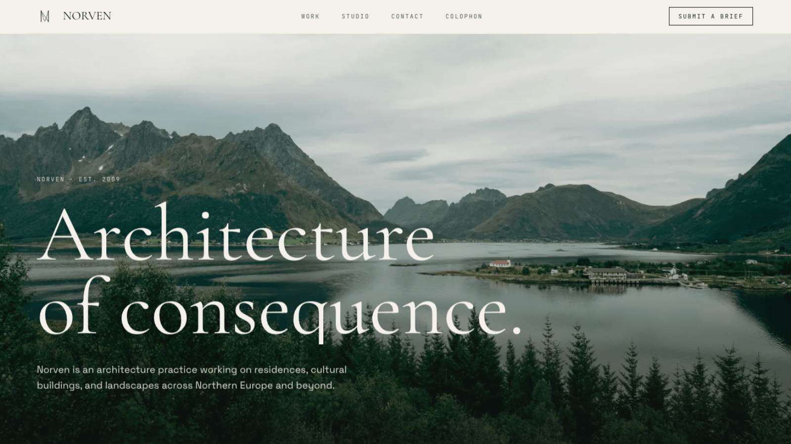

# Norven

I built Norven as a photography-led marketing site for a fictional architecture studio. It is a static Astro 6 portfolio piece with restrained scroll motion, deployed to S3 behind Cloudflare, and engineered with the same discipline I would give a production site.

**Live**: <https://norven.farulivan.com> · **About this build**: <https://norven.farulivan.com/colophon>



[](https://github.com/farulivan/norven/actions/workflows/ci.yml)
[](https://github.com/farulivan/norven/actions/workflows/codeql.yml)
[](https://github.com/farulivan/norven/actions/workflows/lighthouse.yml)
[](https://github.com/farulivan/norven/actions/workflows/e2e.yml)
[](https://renovatebot.com)
[](./LICENSE.md)

## Why this exists

Norven is a fictional studio. The point is the build, not the firm. This codebase demonstrates how I think about:

- **Architecture**: static MPA with strict layering, content collections, one-callback motion runtime, image pipeline behind one component.
- **Quality gates**: a single `pnpm verify` running format, lint, typecheck, unit tests, build, and a bundle budget — plus Playwright E2E, axe a11y, Lighthouse budgets per page, CodeQL, dependency review, and Conventional Commits — all enforced on every PR.
- **Operations**: S3 + Cloudflare with a single edge, IP-allowlisted origin, OIDC-only deploys, $5/mo AWS Budget as the cost ceiling, edge response headers (CSP, HSTS, Permissions-Policy, …) documented as committed Cloudflare Transform Rules.
- **Documentation discipline**: ADRs for load-bearing decisions, deployment runbook with cost analysis, security policy, roadmap with explicit non-goals, an architecture overview that fits on one screen.

If you're skimming this as a hirer, I want five minutes to be enough to see the codebase shape, the decisions behind it, and how it operates in production.

## Stack

| Tool                                                                                             | Family                  | Why this                                                                                                                             | Where                                                                                               |
| ------------------------------------------------------------------------------------------------ | ----------------------- | ------------------------------------------------------------------------------------------------------------------------------------ | --------------------------------------------------------------------------------------------------- |
| [Astro](https://astro.build)                                                                     | 6.x                     | Static MPA + View Transitions; islands when you actually need them.                                                                  | `astro.config.mjs`                                                                                  |
| TypeScript                                                                                       | 6.x, `strictest` preset | Astro's strictest config; catches most at compile time without runtime cost.                                                         | `tsconfig.json`                                                                                     |
| [Tailwind](https://tailwindcss.com)                                                              | 4.x                     | CSS-first config (no `tailwind.config.js`), design tokens in `@theme`.                                                               | `src/styles/global.css`                                                                             |
| [GSAP](https://gsap.com) + ScrollTrigger + [Lenis](https://github.com/darkroomengineering/lenis) | latest                  | Restrained scroll motion behind one `scrollEffect` runtime.                                                                          | `src/lib/motion/` · [ADR-0001](./docs/adr/0001-motion-runtime.md)                                   |
| [Sharp](https://sharp.pixelplumbing.com)                                                         | 0.34.x                  | Build-time image processing via `astro:assets` — AVIF + WebP.                                                                        | Build pipeline                                                                                      |
| [Vitest](https://vitest.dev)                                                                     | 4.x                     | Unit tests for the pure motion core and helpers; not for gsap-bound effects.                                                         | `src/**/*.test.ts`                                                                                  |
| [Playwright](https://playwright.dev) + [axe-core](https://github.com/dequelabs/axe-core)         | latest                  | E2E smoke and WCAG AA gates on every PR — chromium only, ~3s runs.                                                                   | `tests/e2e/`                                                                                        |
| [Lighthouse CI](https://github.com/GoogleChrome/lighthouse-ci)                                   | v12 action              | Per-page performance / a11y / SEO / best-practices budgets. `lhci` comes from `treosh/lighthouse-ci-action`, not a local dependency. | `.lighthouserc.json` · `.github/workflows/lighthouse.yml`                                           |
| GitHub Actions + OIDC                                                                            | —                       | Deploy on push to `main` with no long-lived AWS credentials.                                                                         | `.github/workflows/`                                                                                |
| AWS S3 + Cloudflare                                                                              | Free tiers              | Single-CDN edge over the cheapest static origin. ~$0.02/mo steady state.                                                             | [ADR-0003](./docs/adr/0003-static-hosting-pipeline.md) · [docs/deployment.md](./docs/deployment.md) |

Node `>=22.12.0`, package manager `pnpm 11`.

## Key decisions

The three ADRs in `docs/adr/` cover the load-bearing decisions. Each is short and self-contained:

- **[ADR-0001 · Motion runtime](./docs/adr/0001-motion-runtime.md)** — every scroll-driven effect goes through one `scrollEffect` callback. The lifecycle contract lives in one place; the pure core is unit-tested directly.
- **[ADR-0002 · Photography-led redesign](./docs/adr/0002-photography-led-redesign.md)** — the site retired an earlier WebGL "monolith" identity in favour of photography and restrained motion. Documents what was deleted and what was deliberately kept (the bone/ink/brass palette, Cormorant display type).
- **[ADR-0003 · Static hosting pipeline](./docs/adr/0003-static-hosting-pipeline.md)** — why every managed-platform alternative (Amplify, Vercel, Netlify, Pages) was rejected in favour of S3 + Cloudflare. Bounded cost, full edge control, portable origin.

## Architecture

[ARCHITECTURE.md](./ARCHITECTURE.md) is my one-screen orientation: the render model, module layering, the data and content split, the motion lifecycle, the image pipeline, and the build/deploy boundary — with Mermaid diagrams that render on GitHub.

## Quick start

```bash
git clone https://github.com/farulivan/norven.git
cd norven
pnpm install   # also installs git hooks via lefthook
pnpm dev       # http://localhost:4321
```

Set up the contact form locally by copying `.env.example` to `.env` and adding a free Web3Forms key. The build works without it; the form just won't deliver.

## Commands

| Command                             | What it does                                                                     |
| ----------------------------------- | -------------------------------------------------------------------------------- |
| `pnpm dev`                          | Local dev server at `localhost:4321`.                                            |
| `pnpm build`                        | Static build to `dist/`.                                                         |
| `pnpm preview`                      | Serve the built `dist/` locally.                                                 |
| `pnpm check`                        | `astro check` — typecheck + Astro diagnostics.                                   |
| `pnpm lint` / `pnpm lint:fix`       | ESLint.                                                                          |
| `pnpm format` / `pnpm format:check` | Prettier.                                                                        |
| `pnpm test` / `pnpm test:watch`     | Vitest unit tests.                                                               |
| `pnpm test:e2e`                     | Playwright E2E + axe-core a11y (builds first).                                   |
| `pnpm test:e2e:install`             | One-time install of Playwright chromium (~150 MB).                               |
| `pnpm check:bundle`                 | Compare `dist/_astro/*` JS + CSS totals against `bundle-budget.json`.            |
| `pnpm verify`                       | The full gate: `format:check && lint && check && test && build && check:bundle`. |

See [CONTRIBUTING.md](./CONTRIBUTING.md) for the full local setup, conventional-commit conventions, and PR expectations.

## Deployment

I deploy the static build to S3 (`ap-southeast-1`) on every push to `main`, fronted by Cloudflare for DNS, TLS, CDN, WAF, and rate-limiting. GitHub Actions authenticates to AWS via OIDC — no long-lived deploy credentials anywhere. AWS Budget at $5/mo caps cost exposure even in the worst case. Steady-state spend reads ~$0.02/mo.

Architecture diagrams, security model, cost analysis, and runbook live in [docs/deployment.md](./docs/deployment.md). Edge response headers (CSP, HSTS, Permissions-Policy, COOP, CORP, …) are committed as Cloudflare Transform Rules in [docs/security-headers.md](./docs/security-headers.md). Deferred items and explicit non-goals live in [docs/roadmap.md](./docs/roadmap.md).

## Project structure

```
.
├── ARCHITECTURE.md        # one-screen architecture overview
├── CONTRIBUTING.md        # local setup, PR conventions, my maintainer notes
├── LICENSE.md             # MIT (code) + ARR (brand) + Unsplash (photos)
├── README.md              # start here
├── SECURITY.md            # vulnerability disclosure policy
├── astro.config.mjs       # Astro + Tailwind v4 + sitemap
├── playwright.config.ts   # chromium only, webServer = astro preview
├── vitest.config.ts       # node env, ~/* alias
├── eslint.config.mjs      # flat config: js + typescript-eslint + astro + jsx-a11y
├── lefthook.yml           # commit-msg → commitlint; pre-commit → prettier + eslint
├── renovate.json          # grouped, auto-merged dev-dep patches
├── .lighthouserc.json     # per-page budgets
├── bundle-budget.json     # dist/_astro JS + CSS ceilings
├── .github/
│   ├── workflows/         # ci, deploy, codeql, dependency-review, e2e, lighthouse
│   ├── ISSUE_TEMPLATE/    # bug_report, feature_request, config
│   ├── PULL_REQUEST_TEMPLATE.md
│   └── CODEOWNERS
├── docs/
│   ├── adr/               # 0001 motion runtime · 0002 photo redesign · 0003 hosting
│   ├── deployment.md      # operations runbook
│   ├── security-headers.md
│   └── roadmap.md
├── scripts/
│   ├── check-bundle-budget.mjs
│   └── generate-og.mjs    # composites the share card
├── src/
│   ├── pages/             # /, /projects, /projects/[slug], /studio, /contact, /colophon, /404
│   ├── layouts/           # BaseLayout, PageLayout
│   ├── components/
│   │   ├── layout/        # Nav, Footer, ScrollHud
│   │   ├── media/         # Frame
│   │   └── sections/      # PhotoHero, PageHero, ProjectGrid, … (11 self-contained sections)
│   ├── content/           # projects · team · awards.yaml — Zod-validated
│   ├── data/              # SITE · AUTHOR · services · process · stats
│   ├── lib/               # motion · media · projects (the unit-test surface)
│   ├── styles/global.css  # Tailwind v4 @theme — the only stylesheet
│   ├── consts.ts          # SITE_URL · SITE_NAME · SITE_DESCRIPTION · REPO_URL
│   └── content.config.ts  # collection schemas
└── tests/e2e/             # Playwright + axe — smoke + a11y
```

## Portfolio note

Norven is a fictional architecture studio. I invented the studio, its three offices in Oslo / Lisbon / Kyoto, its built work, its team, and its testimonials end-to-end. The contact details rendered as the studio's (`studio@norven.example`, a Norwegian dialling code that resolves to nothing) are deliberate non-deliverable placeholders. Form submissions reach me (Farul), not a real architecture firm.

The build itself is the artefact. [/colophon](https://norven.farulivan.com/colophon) lays out how I framed it.

## License

[LICENSE.md](./LICENSE.md) — three categories:

- **Code** under MIT.
- **Brand and copy** (Norven name, marks, prose in `src/content/`) all rights reserved.
- **Photographs** licensed via [Unsplash](https://unsplash.com/license) — free commercial and non-commercial use, no attribution required.
