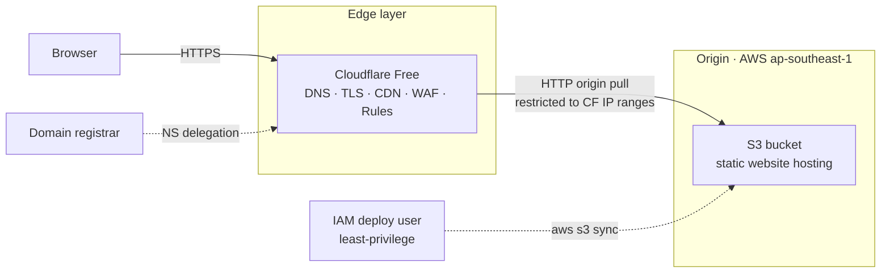
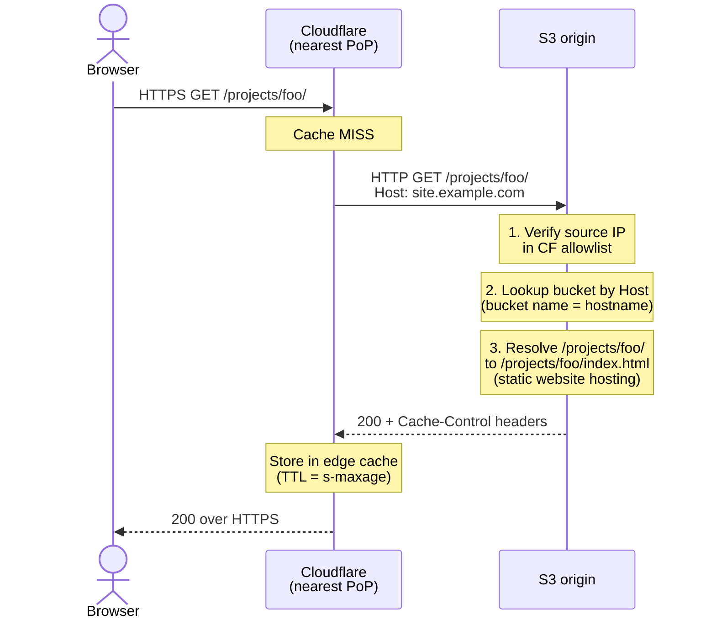
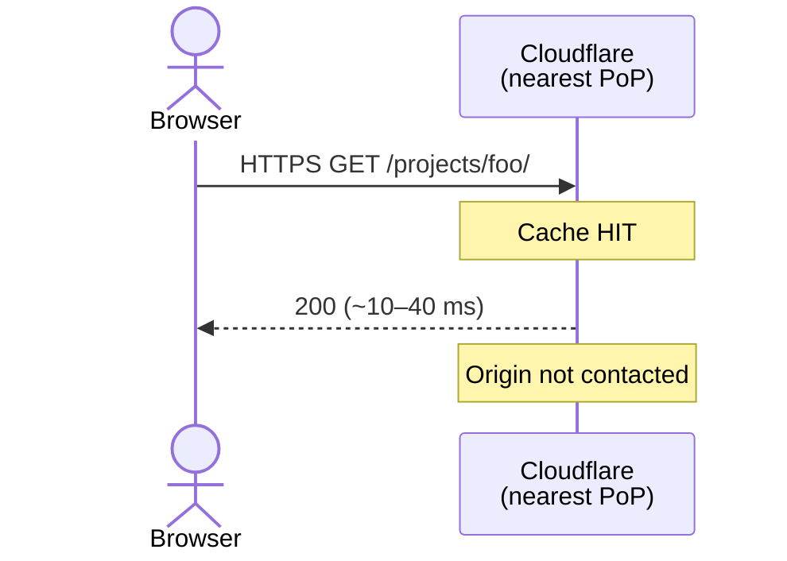

# Deployment

Static Astro site served from Amazon S3 behind Cloudflare. Single-CDN design, IP-allowlisted origin, two-tier cache strategy. Engineered to stay free under steady-state portfolio traffic and bounded under $2/mo even during traffic spikes.

**Live**: [norven.farulivan.com](https://norven.farulivan.com)

## TL;DR

|                                      |                                                                       |
| ------------------------------------ | --------------------------------------------------------------------- |
| **Origin**                           | AWS S3 (`ap-southeast-1`), Static Website Hosting endpoint            |
| **Edge**                             | Cloudflare Free — DNS, TLS, CDN, WAF, rate-limiting, redirect rules   |
| **TLS**                              | Cloudflare Universal SSL (free), HTTPS at edge                        |
| **Origin access**                    | Bucket policy restricts reads to Cloudflare's published IP ranges     |
| **Deploy**                           | `aws s3 sync` from local, two passes for differentiated cache headers |
| **Cost (steady state)**              | ~$0.01/mo                                                             |
| **Cost ceiling (1 TB/mo sustained)** | ~$5/mo                                                                |
| **Cache hit ratio (typical)**        | >95% at Cloudflare edge                                               |
| **Cold-start TTFB (SEA → SG)**       | ~250–350 ms                                                           |
| **Warm TTFB**                        | ~10–40 ms from nearest Cloudflare PoP                                 |

The non-obvious design choice: **only one CDN layer.** Every managed alternative considered (AWS Amplify, Vercel, Netlify) bundles its own CDN, which would have nested under Cloudflare — fragmented cache, doubled TLS termination, paid origin egress on top of free Cloudflare egress. Picking the cheapest possible origin (S3) and letting Cloudflare own every edge concern is what keeps cost asymptotic to zero.

## Architecture



### Components

| Layer           | Service                                  | Responsibility                                                                                                                                 |
| --------------- | ---------------------------------------- | ---------------------------------------------------------------------------------------------------------------------------------------------- |
| Registrar       | Third-party                              | Nameserver delegation only — no DNS records hosted there                                                                                       |
| DNS · Edge      | Cloudflare (Free tier)                   | Authoritative DNS, reverse proxy, TLS termination, edge cache across ~300 PoPs, WAF, redirect rules, HTTPS upgrade                             |
| Origin          | AWS S3 — Static Website Hosting endpoint | Static asset storage with native `index.html` resolution for directory URLs                                                                    |
| Access control  | S3 bucket policy + IAM                   | Bucket policy allows `s3:GetObject` only from Cloudflare IP ranges; deploy IAM user has least-privilege access scoped to the site bucket's ARN |
| Cost guardrails | AWS Budgets + CloudWatch billing alarm   | $5/mo budget alert, plus belt-and-suspenders alarm in `us-east-1` (the only region that emits billing metrics)                                 |

## Request lifecycle

### Cold path (first request, or post-TTL eviction)



### Warm path (subsequent requests within TTL)



After a single cold fetch per asset per PoP, all subsequent requests are served from the Cloudflare edge for the configured TTL. With ~300 PoPs but most real traffic concentrated in a handful of regions, the origin sees roughly 10–50 fetches per HTML file per day even at sustained load.

## Design decisions

### Why not a managed platform (Amplify, Vercel, Netlify, Cloudflare Pages)?

Every managed alternative bundles its own CDN, which would either nest under Cloudflare (double-cache, fragmented hit rates, doubled TLS termination) or replace Cloudflare entirely (losing its free WAF/DDoS/rate-limiting).

| Alternative      | Why rejected                                                                                                                                                                                                                                                          |
| ---------------- | --------------------------------------------------------------------------------------------------------------------------------------------------------------------------------------------------------------------------------------------------------------------- |
| AWS Amplify      | $0.15/GB egress on top of S3 storage; nested CloudFront conflicts with Cloudflare; less granular cache control                                                                                                                                                        |
| Vercel           | Bandwidth-priced ($0.40/GB); excellent for SSR/ISR Next.js but overkill for static; redundant CDN if fronted by Cloudflare                                                                                                                                            |
| Netlify          | Same shape as Vercel; bandwidth-priced                                                                                                                                                                                                                                |
| Cloudflare Pages | Closest fit (single-vendor edge), would have eliminated AWS entirely. **Considered seriously.** Chose S3 to deepen AWS practice and preserve origin portability (S3 API is a commodity; can swap to R2, Backblaze B2, or self-hosted MinIO with no workflow changes). |

Trade-off accepted: no built-in PR previews. Roadmap item: GitHub Actions deploys to per-PR bucket prefixes.

### Why the bucket name equals the hostname

S3 Static Website Hosting routes requests by HTTP `Host` header. With the bucket named identically to the visitor's hostname, S3 resolves the right bucket automatically.

Alternatives all required either complexity or cost:

- Cloudflare Origin Rules → "Override Host Header" — paywalled on the Free tier
- Cloudflare Workers to rewrite Host before forwarding — works on free tier (100k req/day) but introduces code to maintain
- CloudFront with Origin Access Control — different architecture; rejected to keep Cloudflare as sole edge

Matching the names is the canonical Cloudflare→S3 pattern, costs nothing, and removes a moving part.

### Why Flexible SSL (HTTP between Cloudflare and S3)

The S3 Website Hosting endpoint is HTTP-only. The HTTPS-capable REST endpoint loses native `index.html` resolution for directory URLs (`/projects/foo/` → 404 instead of serving `/projects/foo/index.html`). Restoring directory resolution on the REST endpoint requires either a Cloudflare Worker or Cloudflare URL Rewrite Transform Rule.

Picked Flexible (HTTPS visitor↔CF, HTTP CF↔S3) because:

- All content is intentionally public; no auth tokens, no PII, no secrets traverse the CF↔S3 hop
- Bucket policy IP allowlist prevents the broader public from reaching the HTTP endpoint
- AWS Budget alarm caps cost exposure if the allowlist is ever bypassed at scale

Upgrade path if requirements ever change: Cloudflare Authenticated Origin Pulls (mutual TLS — requires a Lambda or proxy in front of S3 since S3 doesn't natively validate client certs), or migrate origin to Cloudflare R2 (S3-compatible API, native CF integration, zero egress).

### Why a two-pass deploy with differentiated cache headers

```
Pass 1: sync everything EXCEPT *.html
        Cache-Control: public, max-age=31536000, immutable

Pass 2: sync only *.html
        Cache-Control: public, max-age=0, s-maxage=600, must-revalidate
```

Hashed asset filenames (Astro emits content hashes by default) mean the URL is a content fingerprint — safe to cache forever, no revalidation, no waste. HTML filenames are stable across deploys, so they must revalidate to pick up content changes; `s-maxage=600` lets the CDN cache for 10 min so most requests don't hit origin, while still propagating deploys globally within 10 minutes without manual cache purges.

A single uniform `aws s3 sync` would either cache HTML too aggressively (stale deploys) or revalidate assets too often (wasted origin pulls).

### Why no Route 53

Route 53 hosted zones cost $0.50/mo per zone. Cloudflare hosts DNS for free as part of the proxy plan. Domain registrar delegates NS records directly to Cloudflare; Cloudflare is authoritative.

Single DNS plane. $6/yr saved.

### Why the deploy IAM user is scoped to a specific bucket ARN

The deploy user can read, write, and delete objects in the site bucket — and nothing else. No `IAM:*`, no `S3:DeleteBucket`, no access to other buckets, no billing, no read access to logs, no ability to spin up expensive resources.

If those credentials leak (laptop stolen, accidental commit, supply-chain compromise), the worst possible outcome is the site contents are altered — recoverable with a `git checkout` and a redeploy. The credentials cannot exfiltrate data from elsewhere in the AWS account or run up a bill on EC2/RDS/SageMaker.

Pairing this with the AWS Budget alarm means even a breach is bounded financially.

## Security model

### Threats mitigated

| Threat                                                 | Mitigation                                                                                                                     |
| ------------------------------------------------------ | ------------------------------------------------------------------------------------------------------------------------------ |
| Direct origin access bypassing the CDN                 | Bucket policy `aws:SourceIp` condition restricts `s3:GetObject` to Cloudflare's published IP ranges                            |
| Origin IP discovery (reconnaissance for targeted DDoS) | Cloudflare proxy hides the origin behind anycast IPs; visitors never resolve to S3 directly                                    |
| L3/L4/L7 DDoS                                          | Cloudflare free-tier DDoS protection (unmetered)                                                                               |
| HTTP downgrade / mixed content                         | "Always Use HTTPS" 301s all HTTP to HTTPS; "Automatic HTTPS Rewrites" rewrites inline HTTP refs                                |
| Stolen deploy credentials                              | IAM policy scoped to the site bucket ARN; cannot escalate, list other buckets, alter billing, or touch other AWS resources     |
| Surprise AWS bill                                      | $5/mo Budget alert plus CloudWatch billing alarm; least-privilege user can't provision expensive resources even if compromised |
| Public bucket listing / path enumeration               | `s3:ListBucket` not granted to `Principal: "*"`; only `s3:GetObject` — paths must be known to retrieve                         |

### Residual risks (acknowledged, accepted at this tier)

| Risk                                                                                                                        | Why accepted                                                                                                                                                           |
| --------------------------------------------------------------------------------------------------------------------------- | ---------------------------------------------------------------------------------------------------------------------------------------------------------------------- |
| Cloudflare IPs are shared across all CF customers — an attacker could front the origin through their own Cloudflare account | Worst case: someone mirrors public content under their domain or runs up bandwidth on origin. Bandwidth is bounded by the AWS Budget alarm. Content is already public. |
| Flexible SSL transmits CF→origin requests in clear text within AWS network                                                  | Content is public; no auth tokens or PII in URLs/bodies                                                                                                                |
| Cloudflare account compromise                                                                                               | Mitigated by MFA on the CF account; ultimate fallback is reverting NS records at the registrar                                                                         |

For a content site with no users, no PII, and no payments, this posture is appropriate. Higher-stakes workloads would upgrade to Authenticated Origin Pulls or migrate origin to Cloudflare R2 with native authenticated access.

## Operations

### Deploy

```text
1. pnpm verify                       # format, lint, typecheck, test, build
2. aws s3 sync (pass 1, non-HTML)    # immutable long-cache
3. aws s3 sync (pass 2, HTML only)   # revalidate short-cache
```

Deploys are atomic at the file level but not transactional across the bucket. A ~30-second window during a multi-pass sync can serve mixed-version files. For a portfolio this is acceptable; at higher stakes, the mitigation is to deploy to a versioned prefix and atomically swap a pointer (CloudFront alias, Worker, or Lambda@Edge).

### Cache invalidation

Default behavior: HTML revalidates within 10 min globally via `s-maxage`; browser cache for HTML is effectively zero.

For instant invalidation: Cloudflare dashboard → Caching → Purge by URL or Purge Everything (free, unlimited).

Hashed assets need no invalidation — they're content-addressed.

### Monitoring

- AWS Budget at $5/mo with email alert at 85% actual / 100% forecasted spend
- CloudWatch billing alarm in `us-east-1` (only region that emits billing metrics)
- Cloudflare analytics dashboard (free tier) for traffic, cache hit ratio, blocked threats

Steady-state cost reads $0.01–$0.10/mo. Anything above $1/mo is anomalous and triggers investigation.

### Rollback

Each deploy is a full `aws s3 sync --delete` — there's no version history in the bucket. Rollback path:

1. `git checkout <previous-commit>`
2. `pnpm build`
3. Re-run the two sync passes

Builds are deterministic, so a checkout of any prior commit restores the corresponding deployed state in ~30 seconds.

## Cost analysis

| Scenario                             | S3 storage | S3 GETs  | S3 egress (cache miss)          | Cloudflare | Monthly total          |
| ------------------------------------ | ---------- | -------- | ------------------------------- | ---------- | ---------------------- |
| Steady state (~10k views/mo)         | $0.001     | $0.00004 | $0.001                          | $0         | **~$0.01**             |
| Viral spike (200 GB in a single day) | $0.001     | $0.40    | $0.50 (cache miss origin pulls) | $0         | **~$0.90 for the day** |
| Sustained 1 TB/mo at 95% cache hit   | $0.001     | $0.40    | ~$4.50                          | $0         | **~$5**                |

Cost is bounded by Cloudflare cache hit rate. At 95%+ hit ratio, origin egress is the only meaningful variable. To stay below $1/mo even at high sustained traffic, the lever is "raise the HTML TTL." `s-maxage=600` is conservative; pushing to `s-maxage=3600` (1 hr) cuts origin egress 6× at the cost of slower global deploy propagation.

The AWS Budget at $5/mo means any cost anomaly produces an alert before it produces a meaningful bill.

## Roadmap

In rough priority order:

1. **GitHub Actions CI/CD with OIDC** — replace manual deploys with auto-deploy on push to `main`. Per-PR previews to scoped bucket prefixes. OIDC trust between GitHub and AWS eliminates long-lived secrets in CI.
2. **Cloudflare Cache Rules** — explicit per-path TTLs to harden cache behavior beyond reliance on origin headers.
3. **Subresource Integrity** for inline-loaded assets — small XSS defense-in-depth.
4. **Authenticated Origin Pulls** — only if a future deployment serves non-public content. Mutual TLS between Cloudflare and origin; needs a small Lambda proxy since S3 doesn't natively validate client certs.
5. **Documented R2 migration path** — if egress costs ever become a constraint, R2's zero-egress model is a single-evening migration via the S3-compatible API.
