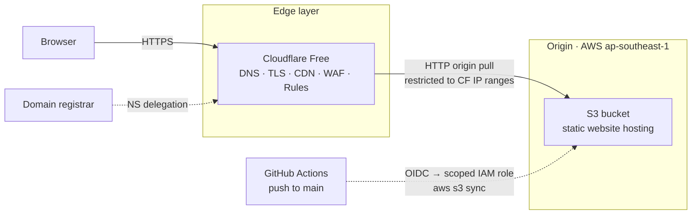
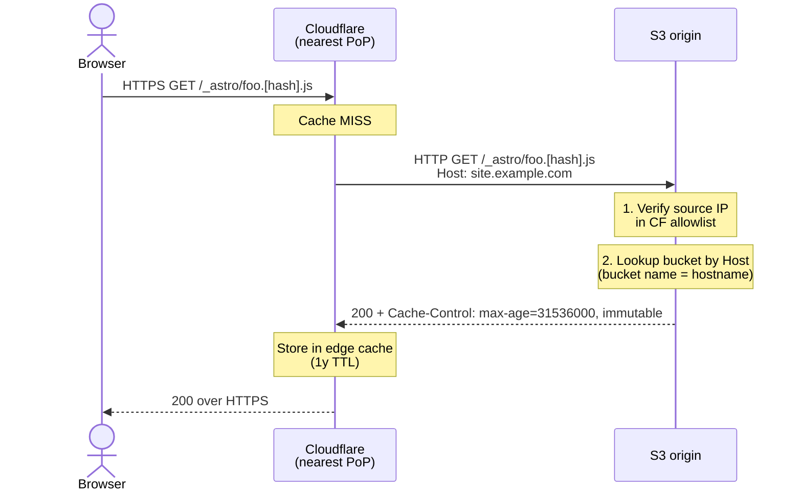
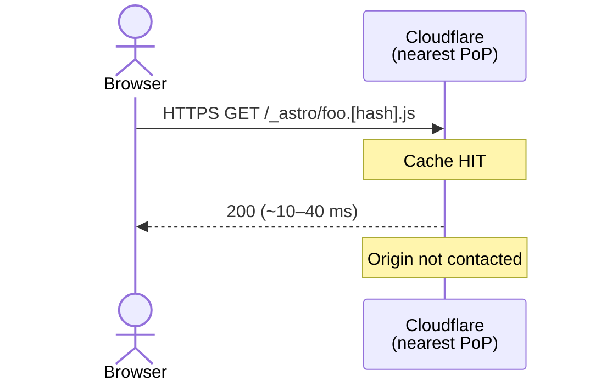
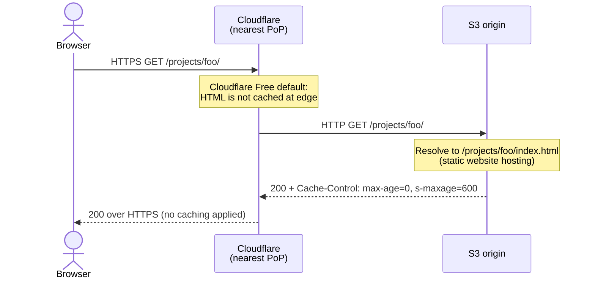

# Deployment

Static Astro site served from Amazon S3 behind Cloudflare. Single-CDN design, IP-allowlisted origin, differentiated cache headers, and OIDC-authenticated CI/CD via GitHub Actions. Engineered to stay free under steady-state portfolio traffic and bounded under $2/mo even during traffic spikes.

**Live**: [norven.farulivan.com](https://norven.farulivan.com)

## TL;DR

|                                      |                                                                                                                                           |
| ------------------------------------ | ----------------------------------------------------------------------------------------------------------------------------------------- |
| **Origin**                           | AWS S3 (`ap-southeast-1`), Static Website Hosting endpoint                                                                                |
| **Edge**                             | Cloudflare Free — DNS, TLS, CDN, WAF, rate-limiting, redirect rules                                                                       |
| **TLS**                              | Cloudflare Universal SSL (free), HTTPS at edge; HSTS enabled                                                                              |
| **Origin access**                    | Bucket policy restricts reads to Cloudflare's published IP ranges                                                                         |
| **Deploy**                           | GitHub Actions on push to `main`; OIDC trust to a scoped IAM role; two-pass `aws s3 sync` with differentiated cache headers               |
| **Edge cache**                       | Hashed assets: 1y immutable. HTML: origin-served (Cloudflare Free's default behavior) — accepted trade-off for instant deploy propagation |
| **Cost (steady state)**              | ~$0.02/mo                                                                                                                                 |
| **Cost ceiling (1 TB/mo sustained)** | ~$5/mo                                                                                                                                    |
| **Cold-start TTFB (SEA → SG)**       | ~250–350 ms                                                                                                                               |
| **Warm asset TTFB**                  | ~10–40 ms from nearest Cloudflare PoP                                                                                                     |

The non-obvious design choice: **only one CDN layer.** Every managed alternative considered (AWS Amplify, Vercel, Netlify) bundles its own CDN, which would have nested under Cloudflare — fragmented cache, doubled TLS termination, paid origin egress on top of free Cloudflare egress. Picking the cheapest possible origin (S3) and letting Cloudflare own every edge concern is what keeps cost asymptotic to zero.

## Architecture



### Components

| Layer           | Service                                  | Responsibility                                                                                                                                                             |
| --------------- | ---------------------------------------- | -------------------------------------------------------------------------------------------------------------------------------------------------------------------------- |
| Registrar       | Third-party                              | Nameserver delegation only — no DNS records hosted there                                                                                                                   |
| DNS · Edge      | Cloudflare (Free tier)                   | Authoritative DNS, reverse proxy, TLS termination, edge cache across ~300 PoPs, WAF, redirect rules, HTTPS upgrade, HSTS                                                   |
| Origin          | AWS S3 — Static Website Hosting endpoint | Static asset storage with native `index.html` resolution for directory URLs                                                                                                |
| Access control  | S3 bucket policy + IAM                   | Bucket policy allows `s3:GetObject` only from Cloudflare IP ranges; deploy IAM role is scoped to the site bucket and assumed by CI/CD via OIDC                             |
| CI/CD           | GitHub Actions                           | Builds, verifies, and deploys on push to `main`. Authenticates to AWS via OIDC (no long-lived credentials); environment-protected to restrict deploys to the `main` branch |
| Cost guardrails | AWS Budgets + CloudWatch billing alarm   | $5/mo budget alert, plus belt-and-suspenders alarm in `us-east-1` (the only region that emits billing metrics)                                                             |

## Request lifecycle

The Cloudflare Free plan caches hashed static assets at the edge but serves HTML directly from origin by default. The two follow distinct paths.

### Hashed assets — first request per Cloudflare PoP



### Hashed assets — subsequent requests (warm cache)



After cold fetch per asset per PoP, served from the Cloudflare edge for the configured TTL. Hashed filenames make the URL content-addressed — a new deploy means new filenames, so "cached forever" is safe.

### HTML — origin-served on every request



Cloudflare Free's default cache rules filter by file extension and do not cache HTML, regardless of origin `Cache-Control` headers. Every HTML page view reaches S3.

This is an accepted trade-off: deploys propagate globally in <1 second (no edge cache TTL to wait out), at the cost of one S3 GET per page view. For static Astro builds, most page weight is in hashed assets which DO cache, so the cost impact is negligible (~$0.02/mo at typical portfolio traffic). A Cloudflare Cache Rule could force HTML caching at the edge — see Roadmap.

## Design decisions

### Why not a managed platform (Amplify, Vercel, Netlify, Cloudflare Pages)?

Every managed alternative bundles its own CDN, which would either nest under Cloudflare (double-cache, fragmented hit rates, doubled TLS termination) or replace Cloudflare entirely (losing its free WAF/DDoS/rate-limiting).

| Alternative      | Why rejected                                                                                                                                                                                                                                                          |
| ---------------- | --------------------------------------------------------------------------------------------------------------------------------------------------------------------------------------------------------------------------------------------------------------------- |
| AWS Amplify      | $0.15/GB egress on top of S3 storage; nested CloudFront conflicts with Cloudflare; less granular cache control                                                                                                                                                        |
| Vercel           | Bandwidth-priced ($0.40/GB); excellent for SSR/ISR Next.js but overkill for static; redundant CDN if fronted by Cloudflare                                                                                                                                            |
| Netlify          | Same shape as Vercel; bandwidth-priced                                                                                                                                                                                                                                |
| Cloudflare Pages | Closest fit (single-vendor edge), would have eliminated AWS entirely. **Considered seriously.** Chose S3 to deepen AWS practice and preserve origin portability (S3 API is a commodity; can swap to R2, Backblaze B2, or self-hosted MinIO with no workflow changes). |

### Why the bucket name equals the hostname

S3 Static Website Hosting routes requests by HTTP `Host` header. With the bucket named identically to the visitor's hostname, S3 resolves the right bucket automatically.

Alternatives all required either complexity or cost:

- Cloudflare Origin Rules → "Override Host Header" — paywalled on the Free tier
- Cloudflare Workers to rewrite Host before forwarding — works on free tier (100k req/day) but introduces code to maintain
- CloudFront with Origin Access Control — different architecture; rejected to keep Cloudflare as sole edge

Matching the names is the canonical Cloudflare→S3 pattern, costs nothing, and removes a moving part.

### Why Flexible SSL (HTTP between Cloudflare and S3)

The S3 Website Hosting endpoint is HTTP-only. The HTTPS-capable REST endpoint loses native `index.html` resolution for directory URLs (`/projects/foo/` → 404 instead of serving `/projects/foo/index.html`). Restoring directory resolution on the REST endpoint requires either a Cloudflare Worker or Cloudflare URL Rewrite Transform Rule.

Picked Flexible (HTTPS visitor↔CF, HTTP CF↔S3) because:

- All content is intentionally public; no auth tokens, no PII, no secrets traverse the CF↔S3 hop
- Bucket policy IP allowlist prevents the broader public from reaching the HTTP endpoint
- AWS Budget alarm caps cost exposure if the allowlist is ever bypassed at scale

Upgrade path if requirements ever change: Cloudflare Authenticated Origin Pulls (mutual TLS — requires a Lambda or proxy in front of S3 since S3 doesn't natively validate client certs), or migrate origin to Cloudflare R2 (S3-compatible API, native CF integration, zero egress).

### Why a two-pass deploy with differentiated cache headers

```
Pass 1: sync everything EXCEPT *.html
        Cache-Control: public, max-age=31536000, immutable

Pass 2: sync only *.html
        Cache-Control: public, max-age=0, s-maxage=600, must-revalidate
```

Hashed asset filenames (Astro emits content hashes by default) mean the URL is a content fingerprint — safe to cache forever, no revalidation, no waste. HTML filenames are stable across deploys, so they must revalidate to pick up content changes.

**On the actual Cloudflare Free behavior**: the asset headers are honored end-to-end — browsers cache 1y, Cloudflare's edge caches 1y. The HTML `s-maxage=600` is honored by browsers and by any compliant intermediate cache, but Cloudflare Free's default behavior is to _not_ cache HTML at the edge regardless of origin Cache-Control. So on the current plan, `s-maxage=600` is effectively documented intent — it'd activate on Cloudflare Pro/Business (which cache HTML by default), or with an explicit Cache Rule on Free.

The two-pass shape is still the right deploy mechanic: it encodes the cache intent in origin response headers, which any compliant CDN (current or future) will respect.

### Why no Route 53

Route 53 hosted zones cost $0.50/mo per zone. Cloudflare hosts DNS for free as part of the proxy plan. Domain registrar delegates NS records directly to Cloudflare; Cloudflare is authoritative.

Single DNS plane. $6/yr saved.

### Why the deploy IAM role is scoped to a specific bucket ARN

The deploy IAM role (assumed by GitHub Actions via OIDC) can read, write, and delete objects in the site bucket — and nothing else. No `IAM:*`, no `S3:DeleteBucket`, no access to other buckets, no billing, no read access to logs, no ability to spin up expensive resources. Each CI run mints a fresh 1-hour STS token; no long-lived credentials exist anywhere.

If the CI environment were ever compromised, the worst possible outcome is the site contents are altered — recoverable with a `git revert` and a redeploy. The role cannot exfiltrate data from elsewhere in the AWS account or run up a bill on EC2/RDS/SageMaker.

Pairing this with the AWS Budget alarm means even a breach is bounded financially.

## Security model

### Threats mitigated

| Threat                                                 | Mitigation                                                                                                                                           |
| ------------------------------------------------------ | ---------------------------------------------------------------------------------------------------------------------------------------------------- |
| Direct origin access bypassing the CDN                 | Bucket policy `aws:SourceIp` condition restricts `s3:GetObject` to Cloudflare's published IP ranges                                                  |
| Origin IP discovery (reconnaissance for targeted DDoS) | Cloudflare proxy hides the origin behind anycast IPs; visitors never resolve to S3 directly                                                          |
| L3/L4/L7 DDoS                                          | Cloudflare free-tier DDoS protection (unmetered)                                                                                                     |
| HTTP downgrade / mixed content                         | "Always Use HTTPS" 301s all HTTP to HTTPS; "Automatic HTTPS Rewrites" rewrites inline HTTP refs; HSTS enabled                                        |
| Stolen deploy credentials                              | No long-lived deploy credentials exist; CI assumes a scoped IAM role via OIDC; STS tokens expire in 1 hour                                           |
| Unauthorised deploys from feature branches or forks    | GitHub Environment restricts deploys to `main`; AWS trust policy requires the production environment in the OIDC `sub` claim — two independent gates |
| Surprise AWS bill                                      | $5/mo Budget alert plus CloudWatch billing alarm; least-privilege IAM role can't provision expensive resources even if abused                        |
| Public bucket listing / path enumeration               | `s3:ListBucket` not granted to `Principal: "*"`; only `s3:GetObject` — paths must be known to retrieve                                               |

### Residual risks (acknowledged, accepted at this tier)

| Risk                                                                                                                        | Why accepted                                                                                                                                                           |
| --------------------------------------------------------------------------------------------------------------------------- | ---------------------------------------------------------------------------------------------------------------------------------------------------------------------- |
| Cloudflare IPs are shared across all CF customers — an attacker could front the origin through their own Cloudflare account | Worst case: someone mirrors public content under their domain or runs up bandwidth on origin. Bandwidth is bounded by the AWS Budget alarm. Content is already public. |
| Flexible SSL transmits CF→origin requests in clear text within AWS network                                                  | Content is public; no auth tokens or PII in URLs/bodies                                                                                                                |
| Cloudflare account compromise                                                                                               | Mitigated by MFA on the CF account; ultimate fallback is reverting NS records at the registrar                                                                         |

For a content site with no users, no PII, and no payments, this posture is appropriate. Higher-stakes workloads would upgrade to Authenticated Origin Pulls or migrate origin to Cloudflare R2 with native authenticated access.

## Operations

### Deploy (CI/CD)

Push to `main` triggers a GitHub Actions workflow that runs end-to-end in ~2–3 minutes:

```
1. Checkout + setup Node/pnpm matched to engines.node
2. pnpm install --frozen-lockfile
3. pnpm verify          # format, lint, typecheck, test, build
4. Assume IAM role via OIDC (1-hour STS token)
5. aws s3 sync (pass 1, non-HTML)    # immutable long-cache
6. aws s3 sync (pass 2, HTML only)   # revalidate short-cache
```

Asset changes appear within seconds for new visitors; revisiting visitors continue serving cached assets until the next page navigation. HTML changes appear immediately on next page load globally (HTML is not edge-cached on Free tier).

**Manual deploy fallback** (when CI is unavailable or for debugging):

```
pnpm verify
aws s3 sync ... (two passes, identical to CI)
```

Local manual deploys use a separate IAM user with the same bucket-scoped policy. Kept around as a fallback only — CI is the primary path.

### CI/CD auth chain

The deploy flow's security model is four independent gates, any one of which is sufficient to block an unauthorised deploy:

1. **GitHub Environment protection** — workflow declares `environment: production`; only the `main` branch is allowed to deploy to this environment
2. **GitHub Environment secrets** — secrets are scoped to the production environment, not available to unrelated workflows
3. **OIDC trust policy** — AWS role only accepts tokens whose `sub` claim matches the production environment of this specific repo
4. **IAM scope** — even with a valid token, the role can only touch the site bucket; no IAM, no other buckets, no billing

A compromised feature branch can't deploy; a malicious PR can't access production secrets; a stolen workflow file can't authenticate to AWS outside this repo's `main` branch.

### Cache invalidation

For **hashed assets**: never needed — URLs are content-addressed. New deploy means new filenames, so visitors automatically fetch the fresh files.

For **HTML**: also never needed on the current setup — Cloudflare Free serves HTML directly from origin, so any change is reflected immediately on the next request.

If HTML edge-caching is ever enabled via a Cache Rule: Cloudflare dashboard → Caching → Purge by URL or Purge Everything (free, unlimited).

### Monitoring

- AWS Budget at $5/mo with email alert at 85% actual / 100% forecasted spend
- CloudWatch billing alarm in `us-east-1` (only region that emits billing metrics)
- Cloudflare analytics dashboard (free tier) for traffic, threats blocked, and asset cache hit ratio
- GitHub Actions workflow history — every deploy logged, with full output retained

Steady-state cost reads $0.01–$0.10/mo. Anything above $1/mo is anomalous and triggers investigation.

### Rollback

Each deploy is a full `aws s3 sync --delete` — there's no version history in the bucket. Rollback path:

1. `git revert <commit>` on `main` (or `git reset` if not yet pushed)
2. Push — CI runs and redeploys automatically
3. Live globally in ~3 minutes

Builds are deterministic, so a checkout of any prior commit restores the corresponding deployed state.

## Cost analysis

| Scenario                                  | S3 storage | S3 GETs                              | S3 egress (cache miss)          | Cloudflare | Monthly total          |
| ----------------------------------------- | ---------- | ------------------------------------ | ------------------------------- | ---------- | ---------------------- |
| Steady state (~10k views/mo)              | $0.001     | ~$0.02 (HTML hits origin every time) | $0.001                          | $0         | **~$0.02**             |
| Viral spike (200 GB in a single day)      | $0.001     | $0.40                                | $0.50 (cache miss origin pulls) | $0         | **~$0.90 for the day** |
| Sustained 1 TB/mo at ~90% asset cache hit | $0.001     | ~$0.50                               | ~$5                             | $0         | **~$5.50**             |

Cost is bounded by two variables:

1. **Asset cache hit rate** — hashed assets dominate page weight; with 1y immutable edge caching, hit rate is ~99% after warm-up
2. **HTML origin pulls** — on Cloudflare Free, every HTML view = one S3 GET. At portfolio scale this is pennies; at scale it's still small (S3 GETs are $0.0004 per 1000)

To halve origin GET costs at very high sustained traffic, the lever is: add a Cloudflare Cache Rule to cache HTML at the edge (see Roadmap). For portfolio scale, not worth the deploy-latency trade-off.

The AWS Budget at $5/mo means any cost anomaly produces an alert before it produces a meaningful bill.

## Roadmap

In rough priority order:

1. **Per-PR preview deploys** — extend the GitHub Actions workflow to deploy PR builds to scoped bucket prefixes, with auto-cleanup on PR close
2. **Cloudflare Cache Rule for HTML** — force edge caching of HTML on the Free plan to reduce origin GET counts at the cost of 10-min global deploy propagation. Trade-off currently rejected (instant deploys preferred at portfolio scale).
3. **Subresource Integrity** for inline-loaded assets — small XSS defense-in-depth
4. **Authenticated Origin Pulls** — only if a future deployment serves non-public content. Mutual TLS between Cloudflare and origin; needs a small Lambda proxy since S3 doesn't natively validate client certs
5. **Documented R2 migration path** — if egress costs ever become a constraint, R2's zero-egress model is a single-evening migration via the S3-compatible API
